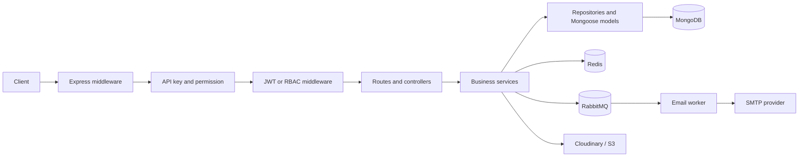

# E-commerce Backend API

An educational e-commerce backend built with Express.js and MongoDB. The service covers shop authentication, product and variant management, inventory, carts, checkout review, discounts, comments, notifications, file uploads, email verification, API-key access, and database-driven role-based access control (RBAC).

> This repository is a learning project and still contains prototype endpoints and development-only assumptions. Review the [current limitations](#current-limitations) before using it outside a local environment.

## Technology stack

- Node.js and Express.js
- MongoDB with Mongoose
- Redis and ioredis for caching, pub/sub, and inventory locks
- RabbitMQ for email messages
- JSON Web Tokens (JWT) with refresh-token rotation
- `accesscontrol` for RBAC permission checks
- Cloudinary and AWS S3/CloudFront for media uploads
- Docker Compose for local MongoDB, Redis, and RabbitMQ
- Winston, Discord logging, Morgan, Helmet, compression, and CORS

## Features

- Shop signup, login, logout, access tokens, and refresh tokens
- Global API-key and API-permission validation
- Roles, resources, grants, and own/any RBAC actions stored in MongoDB
- Polymorphic products for clothing, electronics, and furniture
- SPU/SKU products with selectable variations
- Draft, publish, unpublish, search, and product-detail operations
- Inventory creation, stock updates, and Redis-based reservation locks
- Shopping carts, multi-shop checkout review, and discount calculation
- Nested comments implemented with the nested-set model
- User email verification with one-time tokens and HTML templates
- RabbitMQ email delivery with dead-letter processing in the companion worker
- Notification records for product activity
- Cloudinary URL/file uploads and AWS S3 uploads with signed CloudFront URLs

## Architecture



The application starts in `server.js`, configures middleware and infrastructure in `src/app.js`, and mounts all routes from `src/routes/index.js`. Controllers format HTTP responses, services hold business logic, repositories encapsulate reusable queries, and Mongoose models define persistence.

## Project structure

```text
.
├── server.js                 # Process entry point
├── docker-compose.yml        # MongoDB, Redis, and RabbitMQ
└── src
    ├── app.js                # Express application and middleware
    ├── auth                  # API-key and JWT authentication
    ├── configs               # Database, upload, and cloud configuration
    ├── controllers           # HTTP request/response adapters
    ├── core                  # Success and error response classes
    ├── dbs                   # MongoDB and Redis initialization
    ├── middlewares           # RBAC, cache, role, and logging middleware
    ├── models                # Mongoose schemas and repositories
    ├── routes                # REST route definitions
    ├── services              # Business logic and integrations
    └── tests                 # Experiments and infrastructure scripts
```

## Prerequisites

- Node.js 18 or newer (`node --watch` is used by the development script)
- Yarn
- Docker with Docker Compose, or locally installed MongoDB and Redis
- A RabbitMQ server if email-queue features are used
- Discord bot credentials for the request-logging middleware
- Optional Cloudinary and AWS credentials for upload endpoints

## Installation and local setup

1. Install dependencies:

   ```bash
   yarn install
   ```

2. Start the local infrastructure:

   ```bash
   docker compose up -d
   ```

   The Compose file exposes MongoDB on `27017`, Redis on `6379`, RabbitMQ on `5672`, and the RabbitMQ management UI on `http://localhost:15672`.

3. Create `.env` in the project root. The file is ignored by Git.

   ```dotenv
   NODE_ENV=dev
   DEV_APP_PORT=3055
   DEV_DB_HOST=root:123456@127.0.0.1
   DEV_DB_PORT=27017
   DEV_DB_NAME=shopDEV

   # Used when NODE_ENV=pro
   PRO_APP_PORT=3055
   PRO_DB_HOST=root:123456@127.0.0.1
   PRO_DB_PORT=27017
   PRO_DB_NAME=shop

   REDIS_CACHE_HOST=127.0.0.1
   LOG_LEVEL=info

   # Required by the active Discord request logger
   DISCORD_TOKEN=replace-with-a-discord-bot-token
   CHANNEL_ID=replace-with-a-discord-channel-id

   # Sender shown in queued email messages
   EMAIL_USER=no-reply@example.com

   # Optional: Cloudinary uploads
   CLOUDINARY_CLOUD_NAME=
   CLOUDINARY_API_KEY=
   CLOUDINARY_API_SECRET=

   # Optional: S3 and signed CloudFront URLs
   AWS_BUCKET_REGION=
   AWS_BUCKET_ACCESS_KEY=
   AWS_BUCKET_SECRET_KEY=
   AWS_BUCKET_NAME=
   AWS_CLOUD_FONT_DISTRIBUTION=
   AWS_CLOUD_FONT_KEY_PAIR_ID=
   AWS_CLOUD_FONT_PRIVATE_KEY=
   ```

   The Compose MongoDB container enables authentication. Including `root:123456@` in `DEV_DB_HOST` makes the URI assembled by `src/dbs/init.mongodb.js` compatible with the supplied container.

4. Seed an API key. Every route, including signup and login, passes through the global API-key middleware.

   ```bash
   docker exec -it mongo mongosh \
     -u root -p 123456 --authenticationDatabase admin shopDEV
   ```

   Run this in `mongosh` and replace the example key if needed:

   ```javascript
   db.Apikeys.insertOne({
     key: "local-development-api-key",
     status: true,
     permissions: ["0000"],
     createdAt: new Date(),
     updatedAt: new Date()
   })
   ```

5. Start the API:

   ```bash
   yarn dev
   ```

   The default address is `http://localhost:3055` when `DEV_APP_PORT` is unset.

## Authentication and authorization

Access is applied in layers.

### API key

All requests require an active key with permission `0000`:

```http
x-api-key: local-development-api-key
```

API keys are stored in the `Apikeys` collection. The key is currently sent and stored as plain text.

### Shop access token

Shop signup and login return an access token and refresh token. Protected routes require the shop ID and the raw access token:

```http
x-client-id: 665e887415c538eaabddf385
authorization: eyJhbGciOiJIUzI1NiIs...
```

The `authorization` value must be the raw JWT; the middleware does not strip a `Bearer ` prefix. Access tokens expire after 15 minutes. Refresh tokens expire after seven days and are also stored in an HTTP-only `refreshToken` cookie after login.

Refresh-token reuse invalidates the stored key record and forces the shop to authenticate again. The refresh endpoint reads the token from the cookie rather than the request body.

### RBAC

RBAC uses three MongoDB concepts:

- A **resource** names something protected, such as `profile`.
- A **role** is `user`, `shop`, or `admin` and contains grants.
- A **grant** connects a resource to actions such as `read:own` or `read:any` and an attribute filter.

The profile demonstration loads grants from MongoDB into `accesscontrol`. It currently selects the role from the `role` query parameter, for example `/v1/api/profile/viewAny?role=admin`; it is a demonstration and is not bound to the authenticated user.

## Response format

Successful responses use this envelope:

```json
{
  "message": "Success",
  "status": 200,
  "metadata": {}
}
```

Errors handled by the global error middleware use:

```json
{
  "status": "error",
  "code": 400,
  "message": "Error description"
}
```

## API reference

Every endpoint below requires `x-api-key`. “Shop token” means it additionally requires `x-client-id` and either a valid raw access token or the refresh-token cookie accepted by `authenticationV2`.

### Access

| Method | Path | Additional access | Purpose |
| --- | --- | --- | --- |
| `POST` | `/v1/api/shop/signup` | None | Register a shop and issue tokens |
| `POST` | `/v1/api/shop/login` | None | Authenticate a shop and set its refresh cookie |
| `POST` | `/v1/api/shop/logout` | Shop token | Delete the shop key/token record |
| `POST` | `/v1/api/shop/handleRefreshToken` | Refresh cookie | Rotate the token pair |

### Products, SPUs, and SKUs

| Method | Path | Additional access | Purpose |
| --- | --- | --- | --- |
| `GET` | `/v1/api/product` | None | List published products |
| `GET` | `/v1/api/product/search/:keySearch` | None | Full-text product search |
| `GET` | `/v1/api/product/:product_id` | None | Get product details |
| `GET` | `/v1/api/product/spu/get_spu_info?product_id=...` | None | Get an unpublished SPU and its SKUs |
| `GET` | `/v1/api/product/sku/select_variation?sku_id=...&product_id=...` | None | Resolve a SKU variation; response may be cached |
| `POST` | `/v1/api/product` | Shop token | Create a typed product |
| `POST` | `/v1/api/product/spu/new` | Shop token | Create an SPU and its SKU list |
| `PATCH` | `/v1/api/product/:productId` | Shop token | Update a typed product |
| `POST` | `/v1/api/product/publish/:id` | Shop token | Publish a shop product |
| `POST` | `/v1/api/product/unpublish/:id` | Shop token | Unpublish a shop product |
| `GET` | `/v1/api/product/drafts/all` | Shop token | List the shop’s draft products |
| `GET` | `/v1/api/product/published/all` | Shop token | List the shop’s published products |

The product factory recognizes the exact `product_type` values `Clothing`, `Electronic`, and `Furniture`.

### Discounts, cart, and checkout

| Method | Path | Additional access | Purpose |
| --- | --- | --- | --- |
| `GET` | `/v1/api/discount/list_product_Code` | None | List products eligible for a discount code |
| `POST` | `/v1/api/discount/amount` | None | Calculate a discount for cart items |
| `GET` | `/v1/api/discount` | Shop token | List the shop’s active discounts |
| `POST` | `/v1/api/discount` | Shop token | Create a discount |
| `PATCH` | `/v1/api/discount/:discountId` | Shop token | Update a discount |
| `POST` | `/v1/api/cart` | None | Add an item using `userId` from the body |
| `POST` | `/v1/api/cart/update` | None | Update cart quantity |
| `DELETE` | `/v1/api/cart` | None | Remove an item from a cart |
| `GET` | `/v1/api/cart?userId=...` | None | Retrieve a user cart |
| `POST` | `/v1/api/checkout/review` | None | Recalculate products, discounts, and totals |

The exposed checkout route reviews an order but does not create one. `orderByUser` exists in the service layer and is not mounted as an HTTP route.

### Inventory, comments, and notifications

| Method | Path | Additional access | Purpose |
| --- | --- | --- | --- |
| `POST` | `/v1/api/inventory/` | Shop token | Add stock to a shop inventory record |
| `GET` | `/v1/api/comment/list` | None | List root comments or descendants |
| `POST` | `/v1/api/comment` | Shop token | Create a root comment or reply |
| `DELETE` | `/v1/api/comment` | Shop token | Delete a comment subtree |
| `GET` | `/v1/api/notification/` | Shop token | List notifications using query filters |

### Users, templates, RBAC, profiles, and uploads

| Method | Path | Additional access | Purpose |
| --- | --- | --- | --- |
| `POST` | `/v1/api/user/new_user` | None | Start email-token user registration |
| `GET` | `/v1/api/user/welcome_back?token=...` | None | Consume an email token and create a user |
| `POST` | `/v1/api/user/send_mail` | None | Queue a test email |
| `POST` | `/v1/api/email/new_template` | None | Create the built-in verification template |
| `POST` | `/v1/api/rbac/role` | None | Create a role and grants |
| `GET` | `/v1/api/rbac/roles` | None | List flattened role grants |
| `POST` | `/v1/api/rbac/resource` | None | Create a protected resource |
| `GET` | `/v1/api/rbac/resources` | None | List resources |
| `GET` | `/v1/api/profile/viewAny?role=admin` | RBAC query role | Return demonstration profile data |
| `GET` | `/v1/api/profile/viewOwn?role=shop` | RBAC query role | Return one demonstration profile |
| `POST` | `/v1/api/upload/product` | None | Upload a hardcoded remote image to Cloudinary |
| `POST` | `/v1/api/upload/product/thumb` | None | Upload multipart field `file` through disk storage to Cloudinary |
| `POST` | `/v1/api/upload/product/bucket` | None | Upload multipart field `file` from memory to S3 |

## Request examples

Register a shop:

```bash
curl -X POST http://localhost:3055/v1/api/shop/signup \
  -H 'content-type: application/json' \
  -H 'x-api-key: local-development-api-key' \
  -d '{"name":"Demo Shop","email":"shop@example.com","password":"change-me"}'
```

Login while saving the refresh-token cookie:

```bash
curl -c cookies.txt -X POST http://localhost:3055/v1/api/shop/login \
  -H 'content-type: application/json' \
  -H 'x-api-key: local-development-api-key' \
  -d '{"email":"shop@example.com","password":"change-me"}'
```

Call a protected route using the returned shop ID and access token:

```bash
curl http://localhost:3055/v1/api/product/drafts/all \
  -H 'x-api-key: local-development-api-key' \
  -H 'x-client-id: SHOP_OBJECT_ID' \
  -H 'authorization: ACCESS_TOKEN'
```

Refresh tokens using the saved cookie:

```bash
curl -b cookies.txt -c cookies.txt \
  -X POST http://localhost:3055/v1/api/shop/handleRefreshToken \
  -H 'x-api-key: local-development-api-key' \
  -H 'x-client-id: SHOP_OBJECT_ID'
```

## Email queue integration

User verification and test-email services publish Nodemailer-compatible JSON to `emailQueueProcess`. Messages have a 10-second TTL and dead-letter to `emailExDLX` with routing key `emailRoutingKeyDLX` when rejected or expired. The companion `System_message_queue_Ecomerce_BE` project consumes and sends these messages.

Create the email template before starting the email-token registration flow:

```bash
curl -X POST http://localhost:3055/v1/api/email/new_template \
  -H 'content-type: application/json' \
  -H 'x-api-key: local-development-api-key' \
  -d '{"tem_name":"HTMl Email Token","tem_id":1}'
```

## Scripts and tests

| Command | Description |
| --- | --- |
| `yarn dev` | Start the API with Node.js watch mode |
| `yarn test` | Currently exits with “no test specified” |

Files under `src/tests` are experiments or infrastructure scripts rather than a configured automated test suite. Some of them publish real RabbitMQ messages or write to local databases, so inspect them before running them directly.

## Current limitations

- The RabbitMQ producer connects to the hardcoded URL `amqp://localhost`, while the supplied Compose service requires `root`/`123456`. Email publishing therefore requires aligning the source connection URL with the broker or running a compatible local broker.
- The MongoDB URI builder has no dedicated username/password variables. The example configuration embeds credentials in `DEV_DB_HOST` to match the Compose container.
- Every endpoint requires an API-key document, but the application has no API-key seed command; local setup must insert one manually.
- Cart, checkout review, email/template, RBAC administration, upload, and several user routes only have global API-key protection. Some accept `userId` or `role` directly from request data.
- The RBAC profile endpoints are demonstrations with static response data and trust `?role=` instead of an authenticated role.
- The active request middleware initializes a Discord client at startup and attempts to log every request; it requires a valid `DISCORD_TOKEN` and `CHANNEL_ID` unless that middleware is disabled in code.
- The inventory controller currently references `SuccessResponse` without importing it, so the add-stock endpoint fails while formatting its response.
- CORS only allows `http://localhost:5173`.
- The public Cloudinary URL endpoint ignores the submitted URL and uploads a hardcoded remote image.
- The S3 service always sends `image/jpeg` and returns a short-lived CloudFront signed URL.
- The main automated test script is not implemented.

## License

This project is licensed under the ISC license as declared in `package.json`.
